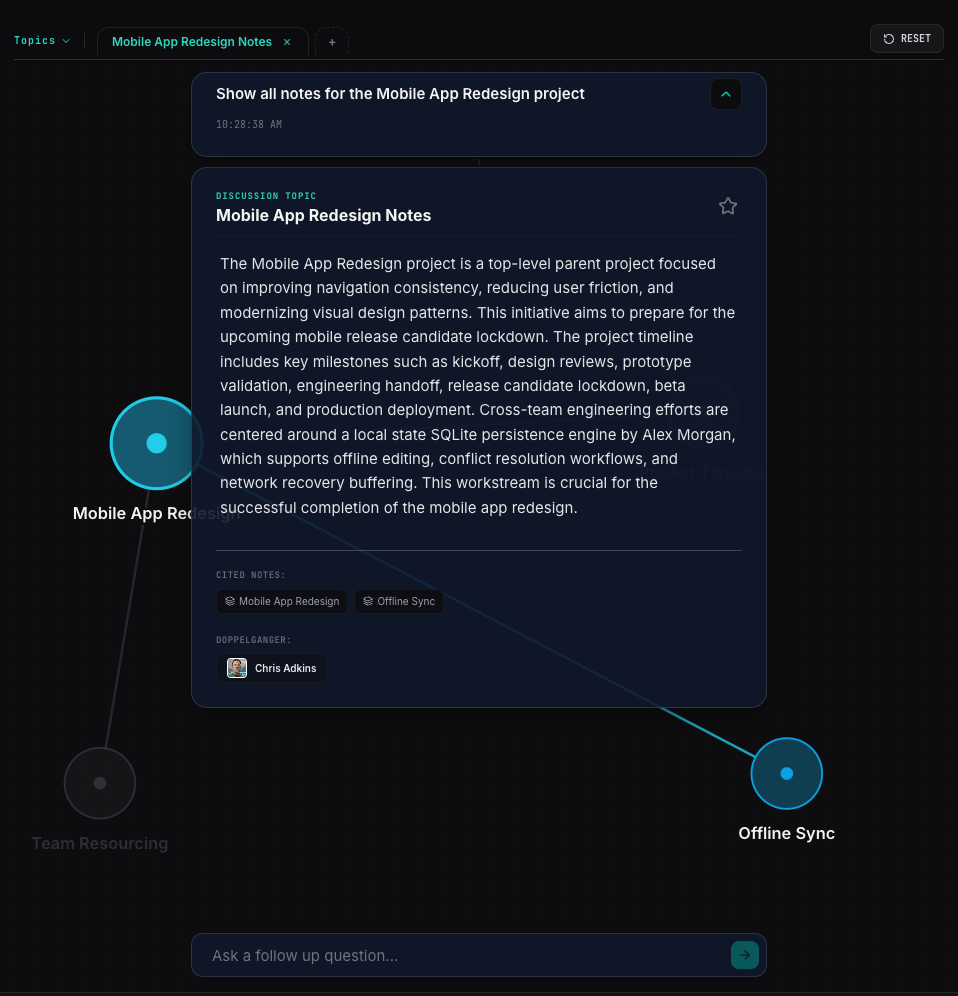

<p align="center">
  
  
</p>

# Doppelganger

[](https://react.dev/)
[](https://vitejs.dev/)
[](https://d3js.org/)
[](https://www.typescriptlang.org/)
[](https://www.docker.com/)

An AI-powered knowledge graph and cognitive twin platform. Doppelganger transforms structured JSON into interactive knowledge maps, allowing Members to create, edit, and explore connected projects, notes, and expertise in real time through two system modes: View Mode and Contribute Mode.

---

## 🌌 Core Features

*   **Brain Swapping & Profile Navigation**: Securely isolate or switch between Member knowledge profiles (`@chris.adkins`, `@jordan.lee`, `@alex.morgan`) dynamically.
*   **Mode-Based Interaction**: Members operate in View Mode for navigating and querying the knowledge graph, and Contribute Mode for creating and editing structured JSON knowledge entries.
*   **V2 Guided Exploration Flow**: Sleek thread timeline cards layered directly over the background graph simulation, enabling fluid follow-up exploration.
*   **Stable D3.js Data Joins**: Optimized SVG rendering pattern preserving DOM elements and drag transitions across state renders, preventing gesture breakages.
*   **Context-Aware Autocomplete**: Triggering floating tag suggestions (`#`) and profile references (`@`) inside both search and refinement inputs.
*   **Passphrase-Locked Nodes**: Dynamic encryption mapping. Certain database nodes remain greyed-out and encrypted (`isolated_passphrase`) until their matching key token hashes are unlocked.
*   **Multi-Perspective Answering**: Synthesized response engine displaying citations and attribution timelines from multiple involved Members.

---

## 🎨 Immersive Design & UI/UX Mechanics

Doppelganger uses a high-contrast dark space UI with layered glassmorphism and pointer-aware interaction zones.

### 1. Layers & Z-Index Stratification

To optimize spatial layout and prevent graph obstruction, UI panels sit above the interactive D3 graph canvas:
*   **Interactive Node Map**: Background SVG layer (`z-index: 1`)
*   **Scrollable Message Stack**: Foreground conversation layer (`z-index: 2`)
*   **Input Dock Panel**: Bottom dock overlay (`z-index: 3`)
*   **AI Answer Card**: Message-level response layer (`z-index: 4`) with backdrop blur for node visibility
*   **Ask Question Card**: Focus capture layer (`z-index: 5`)

### 2. Pointer Event Click-Through System

To preserve node interactivity beneath overlays:
*   **Thread Containers**: Non-interactive wrappers use `pointer-events: none`
*   **Interactive Cards**: Explicit `pointer-events: auto` for inputs, buttons, and scrolling
*   **Map Nodes**: Circle hit targets remain interactive while labels avoid blocking hit areas

### 3. Dynamic Color Families & Edge Focus

Nodes inherit color families from their Level 1 project roots:
*   **Project 1 (Mobile App Redesign)**: Cyan theme (`#22d3ee` / `#155e75`)
*   **Project 2 (Kinetic Type Prototype)**: Red/Pink theme (`#f43f5e` / `#881337`)
*   **Project 3 (Design Sprint Planning)**: Emerald theme (`#34d399` / `#064e3b`)
*   **Project 4 (Branding Framework)**: Amber theme (`#fbbf24` / `#78350f`)

*   **Active links**: colored by project family
*   **Inactive links**: muted grey (`#52525b`)

---

## ⚙️ Architecture

```
                 ┌────────────────────────────────┐
                 │     MEMBER JOURNAL INPUT       │
                 └────────────────┬───────────────┘
                                  │
                                  ▼
                 ┌────────────────────────────────┐
                 │     Stream Compaction Engine   │
                 └────────────────┬───────────────┘
                                  │ (Compacts and maps)
                                  ▼
                 ┌────────────────────────────────┐
                 │      9-Node Dependency Graph   │
                 └────────────────────────────────┘
                                  ▲
                                  │ (Context-secure retrieval)
                 ┌────────────────┴────────────────┐
                 │      VIEW MODE QUERIES          │
                 └─────────────────────────────────┘
```

The system operates across two core pipelines:

*   **Narrative Compaction**: Structured or unstructured Member inputs are parsed into semantic nodes, memory updates, encryption states, and graph relationships.
*   **Retrieval & Grounding**: View Mode queries resolve `@handles` and `#tags`, score relevant nodes, and return structured responses with attribution across the Member graph.

---

## 🚀 Getting Started

### Prerequisites
*   Node.js (v20+ recommended)
*   Docker & Docker Compose (optional, for containerized run)

### Running Locally (Development)

1.  Clone the repository and navigate to the project root.
2.  Install development dependencies:
    ```bash
    npm install
    ```
3.  Set up environment configuration:
    ```bash
    cp .env.example .env
    # Configure your provider in the .env file:
    # Option A (Gemini): Add your GEMINI_API_KEY
    # Option B (LM Studio): Set endpoint configuration (e.g. http://localhost:1234)
    ```
4.  Launch the development server:
    ```bash
    npm run dev
    ```
    This launches the backend engine on port `3000` (which serves the Vite bundle in development mode).

### Running in Production with Docker (Recommended)

The easiest way to run the fully optimized production builds is via Docker Compose:

1.  Build and launch the containerized application:
    ```bash
    docker compose up -d --build
    ```
2.  Access the application at **`http://localhost:3001`**.
3.  Monitor server logs:
    ```bash
    docker compose logs -f
    ```
4.  Stop the application container:
    ```bash
    docker compose down
    ```

---

## 🧪 Verification & Manual Testing

1.  **Tag Suggestions**: Type `#` in the search or refinement boxes to trigger the floating autocomplete tag list.
2.  **Handle Suggestions**: Type `@` to select between available doppelgänger profiles.
3.  **Active Graph Interactivity**: Enter `"Show all notes for the Mobile App Redesign project"`. Verify that:
    *   Cited nodes appear colored in **Cyan** (including the external node **Offline Sync**).
    *   Uncited background nodes are rendered in grey.
    *   Active links are Cyan, while inactive links are grey.
    *   All nodes (active and inactive) can be clicked to open sidebar drawers and dragged smoothly.
    *   Double-clicking or dragging the background canvas pans and zooms the graph seamlessly.
